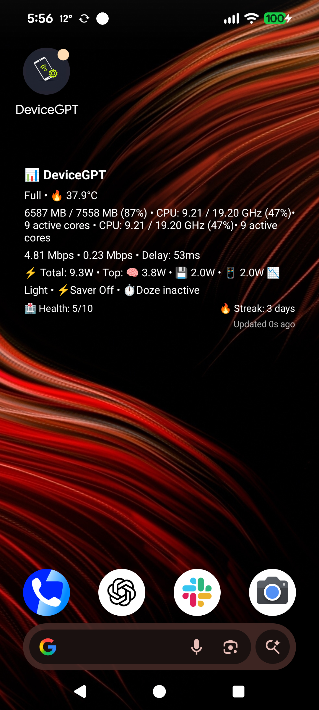
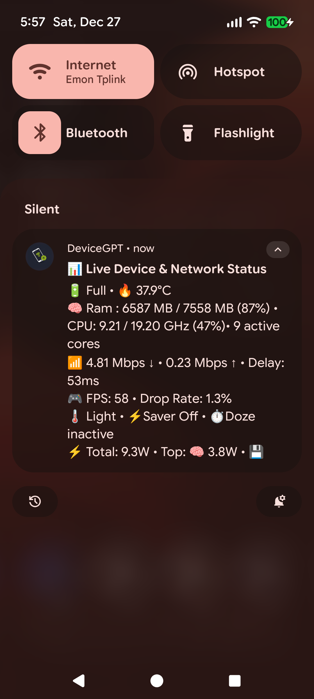
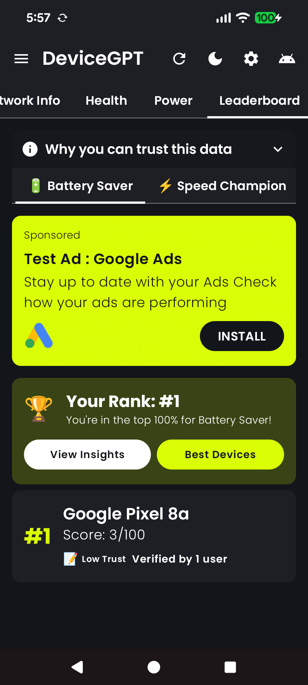
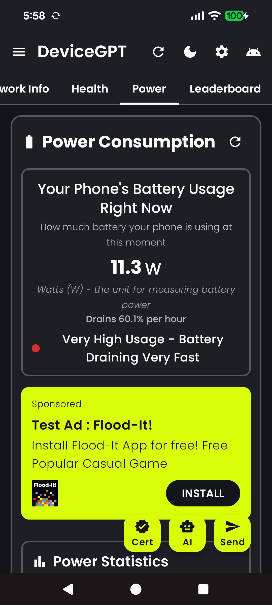
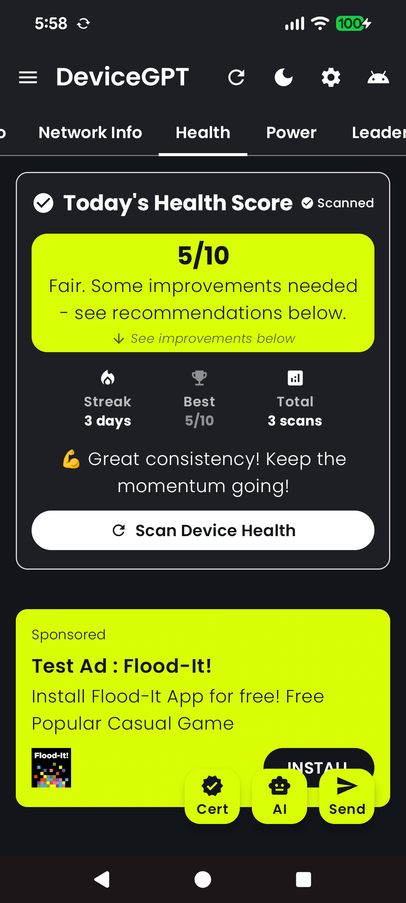
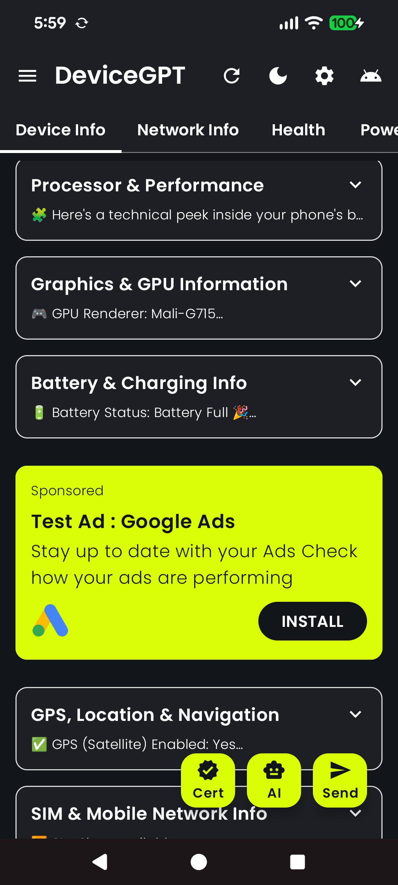
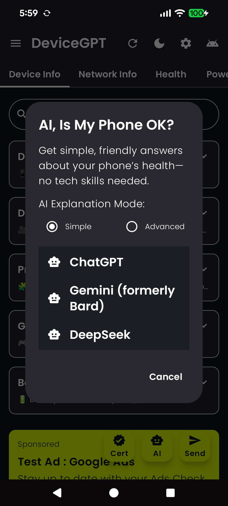
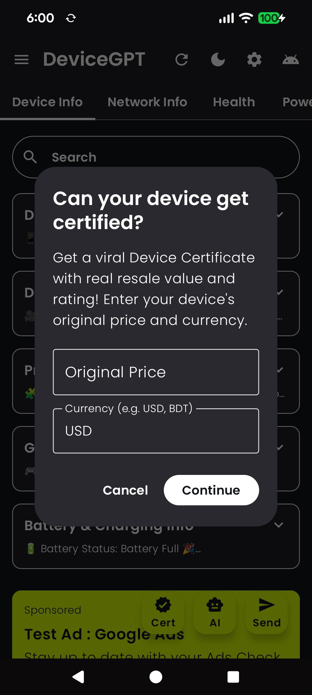
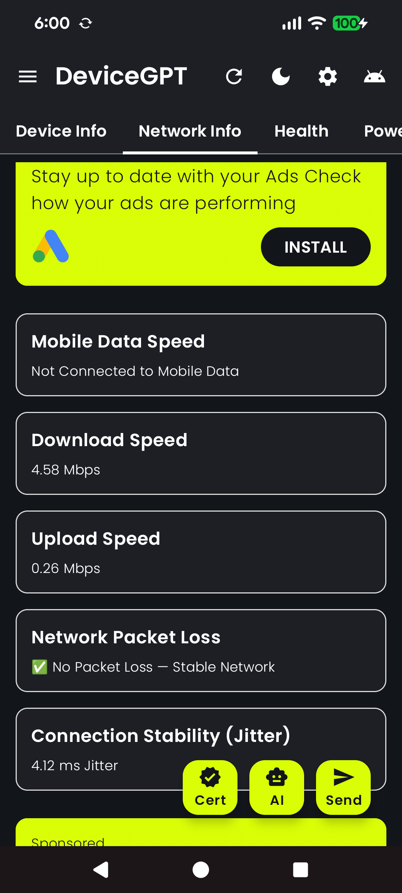

# DeviceGPT: AI Phone Health 📱

<div align="center">


**AI-Powered Android Device Monitoring • Phone Health Checker • Privacy Guardian**

[Features](#-features) • [Quick Start](#-quick-start) • [Contributing](#-contributing) • [💼 Work with Teamz Lab](#work-with-teamz-lab)

</div>

---

## 📥 Download DeviceGPT: AI Phone Health

<div align="center">

[](https://play.google.com/store/apps/details?id=com.teamz.lab.debugger)

[](https://www.producthunt.com/p/devicegpt-ai-phone-health)
[](https://xdaforums.com/t/app-devicegpt-ai-powered-android-monitor-real-data-privacy-guardian-global-leaderboard.4773593/)

**⭐ 500+ Downloads • 🔒 Privacy First • 🤖 AI-Powered**

</div>

---

## What DeviceGPT Does

🔍 **DeviceGPT: AI Phone Health** scans your Android device — battery, storage, mic/camera logs, speed & privacy. Get instant phone reports explained in plain English by ChatGPT, Gemini, or Claude.

**No more confusing graphs or technical data. Just scan → share → understand.**

### For Everyone (Non-Technical)

- ✅ **Check phone performance**: See if your phone is slow, hot, or draining battery
- ✅ **Battery health tracker**: Monitor real-time power consumption (watts), charge speed, and battery life
- ✅ **Privacy scanner**: Detect hidden mic/camera usage, tracking apps, and security threats
- ✅ **Generate certified phone report**: Create a device certificate with resale value estimation
- ✅ **Spot fake GPS**: Detect GPS or sensor spoofing tools
- ✅ **Internet speed test**: Run smart speed tests + ISP privacy checks
- ✅ **Export to AI**: Share your scan directly with AI assistants for instant explanations

### For Developers & Researchers (Technical)

- ✅ **Real-time system monitoring**: CPU, RAM, storage, network via foreground service
- ✅ **Power consumption research**: Component-level power measurement (Camera, Display, CPU, Network) with CSV export
- ✅ **Research-grade experiments**: Standardized testing protocols based on latest power consumption research papers
- ✅ **CSV data export**: Export power experiments for academic research
- ✅ **API-based monitoring**: Uses BatteryManager, ActivityManager, and system APIs (no root required)

**Perfect for:**
- Anyone asking: "Why is my phone slow, hot, or weird?"
- Android developers building device-aware apps
- Researchers studying mobile power consumption
- Parents checking kids' phones
- Privacy-conscious users
- Tech enthusiasts using ChatGPT, Gemini, or Claude regularly

<div align="center">

**[📱 Download on Google Play](https://play.google.com/store/apps/details?id=com.teamz.lab.debugger)** • **[🚀 Try It](#-quick-start)** • **[📖 Build It](#setup)** • **[🤝 Contribute](#-contributing)**

</div>

---

## 🤖 Let AI Explain It To You

**This is DeviceGPT's core feature** — making complex device data understandable through AI.

After each scan, simply tap **"Ask AI"**. We prefill a smart prompt for ChatGPT, Gemini, Claude, Perplexity, Copilot & more. Get instant fixes like:

- **"Battery is overheating, try reducing background apps."**
- **"Mic was used last night, consider revoking app permissions."**
- **"Wi-Fi jitter may affect gaming, restart router."**
- **"Your phone's health score is 7/10. Here's how to improve it..."**

### How It Works

1. **Scan your device** — DeviceGPT collects real-time data (battery, CPU, network, privacy)
2. **Tap "Ask AI"** — Choose your AI assistant (ChatGPT, Gemini, Claude, etc.)
3. **Get plain English answers** — AI explains what the data means and how to fix issues
4. **Simple or Detailed mode** — Choose explanation level based on your technical knowledge

**Supported AI Assistants:**
- ChatGPT (OpenAI)
- Gemini (Google, formerly Bard)
- Claude (Anthropic)
- DeepSeek
- Perplexity
- Microsoft Copilot (Bing AI)
- Grok
- You.com AI Chat
- Replika AI Companion

**Implementation**: `ai_assistant_dialog.kt`, `ai_prompt_generator.kt`, `robust_ai_sharing.kt`

---

## ✨ Features

### 📱 Device Information & Performance

**For Users:**
- Check phone performance, battery health, storage & temperature
- See device model, Android version, and hardware specs
- Monitor frame rate (FPS) and performance metrics
- Check security status (root detection, developer mode)

**For Developers:**
- Real-time CPU, RAM, and storage monitoring via ActivityManager API
- Battery health, temperature, and charging status via BatteryManager API
- Frame rate (FPS) and performance metrics via Choreographer API
- Security status detection (root, developer mode, bootloader state)
- Lock screen widget (Android 13+) for home screen monitoring

**Implementation**: `device_info_ui.kt`, `device_utils.kt`, `SystemMonitorService.kt`, `LockScreenMonitorWidget.kt`

### 🔐 Privacy & Security Scanner

**For Users:**
- Detect mic/camera use & background spying (privacy check)
- Spot fake GPS or sensor spoofing tools
- Anti-snoop motion detector — alerts if someone touched your phone while locked
- Check for spyware and tracking apps

**For Developers:**
- **Mic/Camera Detection**: `isMicrophoneBeingUsed()`, `getRecentCameraMicUsageLog()` — detects background mic/camera usage via logcat
- **Spyware Scanner**: `isDeviceBeingMonitored()` — detects screen recording apps, keyloggers, suspicious accessibility services
- **GPS Spoofing Detection**: `detectSensorSpoofing()` — detects fake GPS apps (Mock Location, Fake GPS, etc.)
- **Motion Detection**: `detectMotionWhileLocked()` — detects if phone moved while locked
- **Keylogger Detection**: `detectKeylogger()` — scans for known keylogger apps
- **Privacy Analysis**: Comprehensive privacy score with tracking analysis, data collection breakdown, and protection strategies

**Implementation**: `device_utils.kt` (lines 1553-1996), `device_info_ui.kt`

### 🌐 Network Monitoring & ISP Privacy

**For Users:**
- Run smart internet speed + ISP privacy test
- Check WiFi signal strength and network information
- Verify ISP privacy, DNS safety, and real 5G/WiFi speed measurements

**For Developers:**
- Network type detection (WiFi, Mobile Data, Ethernet)
- IP address (IPv4/IPv6) and connection details
- Real network speed testing (download/upload via HTTP transfers — actually downloads 10MB from Cloudflare)
- WiFi signal strength (RSSI) and network information
- Network latency measurement (ping-based)
- **ISP Privacy Testing**: DNS manipulation detection, SSL certificate hijack detection, Deep Packet Inspection (DPI) detection, ISP tracking analysis

**Implementation**: `network_ui.kt`, `network_utils.kt`, `SystemMonitorService.kt`

### ❤️ Health Tracking & Scoring

**For Users:**
- Device health score calculation (0-10 scale)
- Daily streak tracking and history
- Achievement system for milestones
- Improvement suggestions based on health score

**For Developers:**
- Device health score calculation based on multiple factors (battery, performance, security, etc.)
- Daily streak tracking and history (stored locally)
- Health trends and statistics
- Achievement system for milestones (`power_achievements.kt`)
- Health score recommendations

**Implementation**: `health_section.kt`, `health_score_utils.kt`, `power_achievements.kt`

### ⚡ Power Consumption Analysis

**For Users:**
- Monitor real-time power consumption (watts)
- See which components (Camera, Display, CPU, Network) use the most power
- Get power recommendations and alerts
- Learn about power consumption through educational content

**For Developers:**
- Component-level power measurement:
  - **Camera**: Per-photo energy measurement with real camera preview (uses BatteryManager API, P = V × I formula)
  - **Display**: Brightness curve analysis
  - **CPU**: Micro-benchmark power profiling
  - **Network**: RSSI vs power correlation
- Real-time power consumption tracking via BatteryManager API
- Power consumption history and aggregated statistics
- Power recommendations and alerts
- Educational content about power consumption
- **CSV export** for research data collection (standardized format)

**Implementation**: `power_consumption_card.kt`, `power_consumption_utils.kt`, `PowerConsumptionAggregator.kt`, `power_recommendations.kt`, `power_alerts.kt`, `power_education.kt`

**Research References**: See [docs/latest_power_consumption_research.md](docs/latest_power_consumption_research.md) for methodology and paper citations.

### 🤖 AI Assistant (Core Feature)

**For Users:**
- Tap "Ask AI" on any device metric to get instant explanations
- Choose Simple or Detailed explanation modes
- Share device data with AI apps for analysis
- Get context-aware recommendations

**For Developers:**
- Tab-specific AI prompts for Device, Network, Health, and Power sections
- Simple and Detailed explanation modes (`PromptMode.Simple`, `PromptMode.Detailed`)
- Context-aware recommendations based on device data
- Share device data with AI apps (ChatGPT, Gemini, Claude, DeepSeek, Perplexity, and more) via robust sharing function
- Item-specific AI analysis for individual device metrics
- Pre-filled smart prompts that guide AI to provide actionable advice

**Implementation**: `ai_assistant_dialog.kt`, `ai_prompt_generator.kt`, `robust_ai_sharing.kt`

### 🏆 Additional Features

- **Leaderboard**: Compete on device health metrics with Gmail account linking (global rankings)
- **Device Certificate**: Generate certified phone reports with resale value estimation via AI (boosts resale value on eBay, Swappa, Marketplace)
- **System Monitoring Service**: Background foreground service for continuous monitoring
- **Automatic Sleep Tracker**: Track device sleep/wake patterns for battery optimization (`DeviceSleepTracker.kt`)
- **AI Compatibility Test**: Check if your phone supports on-device LLMs and AI apps
- **Push Notifications**: OneSignal integration for notifications
- **Analytics**: Firebase Analytics with privacy-respecting implementation
- **Material Design 3**: Modern UI with theme support (light/dark mode)
- **Referral System**: Share and track app referrals
- **In-App Review**: Google Play In-App Review API integration

**Implementation**: `LeaderboardSection.kt`, `LeaderboardManager.kt`, `SystemMonitorService.kt`, `Application.kt`, `referral_manager.kt`, `ReviewPromptManager.kt`, `DeviceSleepTracker.kt`

---

## 📋 Feature → Code Mapping

Quick reference for developers exploring the codebase:

| Feature | Main Implementation Files |
|---------|--------------------------|
| Device Information | `ui/device_info_ui.kt`, `utils/device_utils.kt` |
| Privacy & Security Scanner | `utils/device_utils.kt` (spyware, mic/camera, GPS spoofing detection) |
| Network Monitoring | `ui/network_ui.kt`, `utils/network_utils.kt` |
| Power Consumption | `ui/power_consumption_card.kt`, `utils/power_consumption_utils.kt` |
| Health Scoring | `ui/health_section.kt`, `utils/health_score_utils.kt` |
| **AI Assistant** | `ui/ai_assistant_dialog.kt`, `utils/ai_prompt_generator.kt` |
| Background Monitoring | `services/system_monitor_service.kt` |
| Leaderboard | `ui/LeaderboardSection.kt`, `utils/LeaderboardManager.kt` |
| Device Certificate | `MainActivity.kt` (AI-powered certificate generation) |
| Sleep Tracking | `utils/DeviceSleepTracker.kt` |

---

## 📸 Screenshots

<div align="center">

### Device Information & Performance





### Privacy & Security Scanner




### Network & Health




### Power & AI Assistant




</div>

---

## 🚀 Quick Start

### Prerequisites

- **Android Studio Iguana (2024.1.1)** or later (required for AGP 8.13.0)
- **JDK 8** or higher
- **Android SDK** (API 24+)
- **Gradle 8.13** (included via wrapper)

### Build and Run

```bash
# Clone the repository
git clone https://github.com/Teamz-Lab-LTD/device-gpt.git
cd device-gpt

# Build debug APK
./gradlew assembleDebug

# Or open in Android Studio and click "Run"
```

The app will run with test AdMob IDs and placeholder configurations. For production features, see [Configuration](#configuration) below.

---

<a name="setup"></a>
## ⚙️ Setup

### Configuration

All sensitive configuration is managed via `local_config.properties` (not committed to git). This keeps the repository open-source friendly while allowing you to use your own credentials.

#### 1. Firebase Configuration

**Required for**: Authentication, Firestore, Analytics, Crashlytics, Remote Config

1. Copy the template:
   ```bash
   cp app/google-services.json.template app/google-services.json
   ```

2. Get your Firebase config from [Firebase Console](https://console.firebase.google.com/)

3. Replace all placeholder values in `app/google-services.json`:
   - `YOUR_PROJECT_NUMBER`
   - `YOUR_PROJECT_ID`
   - `YOUR_MOBILE_SDK_APP_ID`
   - `YOUR_OAUTH_CLIENT_ID`
   - `YOUR_FIREBASE_API_KEY`
   - `YOUR_ADMOB_APP_ID`

#### 2. AdMob Configuration (Optional)

**Required for**: Displaying ads

1. Copy the template:
   ```bash
   cp local_config.template local_config.properties
   ```

2. Add your AdMob IDs to `local_config.properties`:
   ```properties
   ADMOB_APP_ID=ca-app-pub-XXXXXXXXXXXXXXXX~XXXXXXXXXX
   APP_OPEN_AD_UNIT_ID=ca-app-pub-XXXXXXXXXXXXXXXX/XXXXXXXXXX
   INTERSTITIAL_AD_UNIT_ID=ca-app-pub-XXXXXXXXXXXXXXXX/XXXXXXXXXX
   NATIVE_AD_UNIT_ID=ca-app-pub-XXXXXXXXXXXXXXXX/XXXXXXXXXX
   REWARDED_AD_UNIT_ID=ca-app-pub-XXXXXXXXXXXXXXXX/XXXXXXXXXX
   ```

3. The app will automatically use these IDs via `AdConfig.kt`. No manual file editing needed.

**Note**: If `local_config.properties` is missing, the app uses Google test ad IDs (debug builds only).

#### 3. OAuth Client ID Configuration (Optional)

**Required for**: Google Sign-In (leaderboard feature)

Add to `local_config.properties`:
```properties
OAUTH_CLIENT_ID=YOUR_CLIENT_ID.apps.googleusercontent.com
```

The OAuth Client ID is automatically injected into `strings.xml` at build time. No manual editing needed.

#### 4. OneSignal Configuration (Optional)

**Required for**: Push notifications

Add to `local_config.properties`:
```properties
ONESIGNAL_APP_ID=your-onesignal-app-id
```

#### 5. Signing Configuration (Optional - for release builds)

1. Copy the template:
   ```bash
   cp key.properties.template key.properties
   ```

2. Generate a keystore:
   ```bash
   keytool -genkey -v -keystore release-key.jks -keyalg RSA -keysize 2048 -validity 10000 -alias release-key
   ```

3. Update `key.properties` with your credentials:
   ```properties
   storePassword=your_store_password
   keyPassword=your_key_password
   keyAlias=release-key
   storeFile=release-key.jks
   ```

**Note**: For debug builds, this step is optional. The app will use debug signing if `key.properties` is missing.

### Configuration Files Summary

| File | Purpose | Required | Template |
|------|---------|----------|----------|
| `app/google-services.json` | Firebase configuration | Yes | `app/google-services.json.template` |
| `local_config.properties` | AdMob, OAuth, OneSignal IDs | Optional | `local_config.template` |
| `key.properties` | Release signing | Optional (release only) | `key.properties.template` |
| `local.properties` | Android SDK path | Auto-generated | N/A |

**⚠️ Important**: Never commit sensitive files. They are already in `.gitignore`.

---

## 🔧 Troubleshooting

### Common Setup Issues

#### `google-services.json` Missing or Invalid

**Symptoms**: Build fails with "File google-services.json is missing" or Firebase initialization errors.

**Solution**:
1. Ensure `app/google-services.json` exists (copy from template)
2. Verify all placeholder values are replaced with actual Firebase credentials
3. Check that `package_name` in `google-services.json` matches `applicationId` in `app/build.gradle.kts` (should be `com.teamz.lab.debugger`)
4. Sync project: `File → Sync Project with Gradle Files` in Android Studio

#### AdMob IDs Showing Placeholders

**Symptoms**: App shows test ads or "YOUR_ADMOB_APP_ID" in logs.

**Solution**:
1. Create `local_config.properties` from `local_config.template`
2. Add your AdMob App ID and Ad Unit IDs to `local_config.properties`
3. Ensure file is in project root (same level as `build.gradle.kts`)
4. Rebuild project: `./gradlew clean assembleDebug`
5. Verify `AdConfig.kt` reads from `BuildConfig` fields (set at build time)

#### OAuth Client ID Mismatch

**Symptoms**: Google Sign-In fails with "OAuth client ID mismatch" error.

**Solution**:
1. Verify OAuth Client ID in `local_config.properties` matches Firebase Console
2. Ensure format is correct: `YOUR_CLIENT_ID.apps.googleusercontent.com` (include `.apps.googleusercontent.com` suffix)
3. Check that OAuth Client ID in Firebase Console is for package name `com.teamz.lab.debugger`
4. Rebuild project to inject ID into `strings.xml` via `resValue` in `build.gradle.kts`

#### Gradle Sync or Version Issues

**Symptoms**: "Gradle sync failed" or "Unsupported class file major version" errors.

**Solution**:
1. **Android Studio Version**: Ensure Android Studio Iguana (2024.1.1) or later
2. **JDK Version**: Use JDK 8 or higher (check: `File → Project Structure → SDK Location → JDK location`)
3. **Gradle Wrapper**: Use included wrapper: `./gradlew --version` should show Gradle 8.13
4. **Clean Build**: 
   ```bash
   ./gradlew clean
   ./gradlew --stop
   ```
   Then sync again in Android Studio
5. **Invalidate Caches**: `File → Invalidate Caches → Invalidate and Restart`

#### Build Fails with "Cannot find symbol" or Missing Dependencies

**Solution**:
1. Sync Gradle: `File → Sync Project with Gradle Files`
2. Check internet connection (Gradle downloads dependencies)
3. Clear Gradle cache: `rm -rf ~/.gradle/caches/` (macOS/Linux) or `%USERPROFILE%\.gradle\caches\` (Windows)
4. Rebuild: `./gradlew clean build`

---

## 🏗️ Architecture

### High-Level Overview

- **Architecture Pattern**: MVVM (Model-View-ViewModel)
- **UI Framework**: Jetpack Compose with Material Design 3
- **Language**: Kotlin 2.1.0
- **Dependency Injection**: Manual (no Hilt/Koin)

### Key Components

- **MainActivity**: Single-activity app with tab-based navigation
- **ViewModels**: `DeviceInfoViewModel`, `PowerConsumptionViewModel` for state management
- **Background Service**: `SystemMonitorService` (foreground service) for continuous monitoring
- **Data Flow**: 
  - UI → ViewModel → Utils/Services
  - Services → SharedPreferences/Flow → UI
- **Firebase Integration**: Auth, Firestore, Analytics, Crashlytics, Remote Config

### Project Structure

```
device-gpt/
├── app/
│   ├── src/
│   │   ├── main/
│   │   │   ├── java/com/teamz/lab/debugger/
│   │   │   │   ├── MainActivity.kt          # Main activity
│   │   │   │   ├── Application.kt          # App initialization
│   │   │   │   ├── ui/                      # UI components
│   │   │   │   │   ├── device_info_ui.kt
│   │   │   │   │   ├── network_ui.kt
│   │   │   │   │   ├── health_section.kt
│   │   │   │   │   ├── power_consumption_card.kt
│   │   │   │   │   ├── LeaderboardSection.kt
│   │   │   │   │   ├── ai_assistant_dialog.kt
│   │   │   │   │   └── ...
│   │   │   │   ├── utils/                   # Utility classes
│   │   │   │   │   ├── AdConfig.kt          # Centralized ad config
│   │   │   │   │   ├── power_consumption_utils.kt
│   │   │   │   │   ├── device_utils.kt      # Privacy/security detection
│   │   │   │   │   ├── ai_prompt_generator.kt  # AI prompt generation
│   │   │   │   │   ├── LeaderboardManager.kt
│   │   │   │   │   ├── DeviceSleepTracker.kt
│   │   │   │   │   └── ...
│   │   │   │   ├── services/                # Background services
│   │   │   │   │   └── system_monitor_service.kt
│   │   │   │   ├── widgets/                 # App widgets
│   │   │   │   │   └── LockScreenMonitorWidget.kt
│   │   │   │   └── receivers/               # Broadcast receivers
│   │   │   └── res/                         # Resources
│   │   ├── test/                            # Unit tests (31 files)
│   │   └── androidTest/                     # UI tests (17 files)
│   ├── build.gradle.kts
│   └── google-services.json.template
├── docs/                                    # Documentation
│   ├── images/                              # Screenshots
│   ├── latest_power_consumption_research.md
│   └── Bridging the Gap Between Research Papers and Code.pdf
├── gradle/
├── build.gradle.kts
├── settings.gradle.kts
├── README.md
├── LICENSE
└── CONTRIBUTING.md
```

---

## 🧪 Testing

The project includes comprehensive test coverage:

- **Unit Tests**: 31 test files covering utilities, managers, and core functionality
- **Android Tests**: 17 test files for UI components, user flows, and integration testing

### Running Tests

```bash
# Run all unit tests
./gradlew :app:testDebugUnitTest

# Run all UI tests (requires device/emulator)
./gradlew :app:connectedAndroidTest

# Generate coverage report
./gradlew :app:testDebugUnitTest
./gradlew :app:jacocoTestReport
```

Coverage reports are generated in `app/build/reports/jacoco/jacocoTestReport/html/index.html`

See [TESTING_GUIDE.md](TESTING_GUIDE.md) for detailed testing information.

---

## 🔒 Privacy & Data

### Data Collection

**Local Data (Stored on Device):**
- Device information (CPU, RAM, battery, network stats)
- Health scores and streaks
- Power consumption measurements
- App preferences and settings
- Privacy scan results (mic/camera logs, spyware detection)

**Remote Data (Firebase):**
- **Firebase Analytics**: App usage events, feature interactions (anonymized)
- **Firebase Crashlytics**: Crash reports and stack traces
- **Firebase Firestore**: Leaderboard data (health scores, user IDs)
- **Firebase Auth**: Anonymous authentication and optional Gmail linking
- **Firebase Remote Config**: Feature flags and ad configuration

**OneSignal:**
- Push notification tokens and delivery status

### Privacy Features

- **Works Offline**: Most features work without internet (device info, health scoring, power tracking, privacy scans)
- **No Account Required**: Use the app without creating an account
- **Anonymous Authentication**: Leaderboard uses Firebase anonymous auth by default
- **Optional Gmail Linking**: Users can optionally link Gmail for leaderboard persistence
- **No Data Leaves Device**: Unless you explicitly share it (via AI Assistant or export)
- **Analytics Respects Device Settings**: Analytics are not sent when device is in:
  - Battery Saver Mode
  - Do Not Disturb Mode
  - Airplane Mode
  - Doze Mode (deep sleep)

### How to Disable Analytics

Analytics are automatically disabled in restricted device modes (see above). For complete opt-out:

1. Disable Firebase Analytics in your Firebase project console
2. Or modify `AnalyticsUtils.kt` to always return early in `logEvent()`

**Note**: Analytics help improve the app. Consider keeping them enabled to support development.

---

## 🛠️ Tech Stack

- **Language**: Kotlin 2.1.0
- **UI Framework**: Jetpack Compose (Material 3)
- **Architecture**: MVVM with ViewModel
- **Dependency Injection**: Manual (can be migrated to Hilt/Koin)
- **Backend**: 
  - Firebase (Firestore, Analytics, Crashlytics, Remote Config, Auth)
  - OneSignal (Push Notifications)
- **Ads**: Google AdMob
- **Background Tasks**: WorkManager
- **Authentication**: Firebase Auth + Credential Manager API
- **Testing**: JUnit, Robolectric, Espresso, Compose UI Test
- **Build System**: Gradle 8.13 with Kotlin DSL

---

## 🗺️ Roadmap

Future improvements (based on code TODOs and research docs):

- **Enhanced Power Experiments**: Display brightness curve calibration, CPU micro-benchmark improvements
- **ODPM Integration**: On-Device Power Rails Monitor support where available
- **AI Workload Monitoring**: Power analysis for AI/ML inference tasks
- **Comparative Analysis**: Device-to-device power consumption comparisons
- **Research Data Portal**: Web interface for aggregated power research data

See [docs/latest_power_consumption_research.md](docs/latest_power_consumption_research.md) for detailed research roadmap.

---

## ❓ FAQ

### Does it require root access?

**No.** DeviceGPT works on stock Android devices without root access. All monitoring uses standard Android APIs:
- BatteryManager API for power measurements
- ActivityManager for RAM/CPU info
- Network APIs for network testing
- System APIs for device information

Some advanced features (like detailed CPU frequency monitoring) may have limited data on non-root devices, but core functionality works without root.

### Does it work offline?

**Yes, most features work offline:**
- ✅ Device information (CPU, RAM, battery, storage)
- ✅ Health scoring and history
- ✅ Power consumption tracking
- ✅ Privacy scans (mic/camera detection, spyware scanner)
- ✅ Local data viewing

Features that require internet:
- ❌ Network speed testing (download/upload)
- ❌ Network latency measurement
- ❌ Leaderboard sync
- ❌ AI Assistant sharing (needs internet to share with AI apps)
- ❌ Firebase Analytics/Crashlytics

### Can I export data (CSV)?

**Yes.** Power consumption experiments support CSV export:
- Camera power experiments
- CPU micro-benchmark tests
- App power consumption data
- Network RSSI vs power correlation

CSV files are exported via `PowerConsumptionUtils.exportExperimentCSV()` and can be shared through Android's share dialog. See `power_consumption_card.kt` for export UI implementation.

### What device versions are supported?

**Android 7.0 (API 24) and higher.**
- **Minimum SDK**: API 24 (Android 7.0 Nougat)
- **Target SDK**: API 36 (Android 15)
- **Compile SDK**: API 36

Some features have additional requirements:
- Lock screen widget: Android 13+ (API 33+)
- Notification permission: Android 13+ (API 33+)
- Background location: Android 10+ (API 29+) for some network features

### How is power measured?

Power measurement uses the **BatteryManager API** with the physics formula **P = V × I**:
- **Voltage (V)**: From `BatteryManager.EXTRA_VOLTAGE` (real millivolts)
- **Current (I)**: From `BatteryManager.BATTERY_PROPERTY_CURRENT_NOW` (real microamps)

**Methodology** (from `power_consumption_utils.kt`):
- Real system data only (no estimates or simulations)
- Component-level measurements: Camera, Display, CPU, Network
- If real data unavailable, returns 0.0 (no fallback estimates)
- Uses baseline → workload → post-workload delta measurements

For detailed methodology and research references, see [docs/latest_power_consumption_research.md](docs/latest_power_consumption_research.md).

---

## 🤝 Contributing

We welcome contributions! Please see [CONTRIBUTING.md](CONTRIBUTING.md) for detailed guidelines.

### Quick Start for Contributors

1. Fork the repository
2. Create a feature branch (`git checkout -b feature/amazing-feature`)
3. Make your changes
4. Write/update tests (unit tests for utils, UI tests for composables)
5. Ensure all tests pass: `./gradlew :app:testDebugUnitTest`
6. Commit your changes (`git commit -m 'Add amazing feature'`)
7. Push to the branch (`git push origin feature/amazing-feature`)
8. Open a Pull Request

### Code Style

- Follow Kotlin coding conventions
- Use meaningful variable and function names
- Add KDoc comments for public APIs
- Write tests for new features

---

## 📄 License

This project is licensed under the MIT License - see the [LICENSE](LICENSE) file for details.

---

## 🙏 Acknowledgments

- Research papers and methodologies that inspired the power consumption features (see [docs/latest_power_consumption_research.md](docs/latest_power_consumption_research.md))
- Android community for excellent tools and libraries
- All contributors who help improve this project

---

## 📞 Support

**App Support:**
- 📱 [Google Play Store](https://play.google.com/store/apps/details?id=com.teamz.lab.debugger) - Rate, review, and get app updates
- 📧 **Email**: hello@teamzlab.com
- 📞 **Phone**: +44 7365 602184

**Development Support:**
- **Issues**: [GitHub Issues](https://github.com/Teamz-Lab-LTD/device-gpt/issues)
- **Discussions**: [GitHub Discussions](https://github.com/Teamz-Lab-LTD/device-gpt/discussions)
- **Community**: [XDA Forums](https://xdaforums.com/t/app-devicegpt-ai-powered-android-monitor-real-data-privacy-guardian-global-leaderboard.4773593/)

---

## ⭐ Show Your Support

If you find this project useful:

1. **⭐ Star this repository** on GitHub
2. **📱 [Download DeviceGPT](https://play.google.com/store/apps/details?id=com.teamz.lab.debugger)** on Google Play
3. **⭐ Rate and review** on Google Play Store
4. **🚀 [Upvote on Product Hunt](https://www.producthunt.com/p/devicegpt-ai-phone-health)**
5. **💬 [Join the discussion](https://xdaforums.com/t/app-devicegpt-ai-powered-android-monitor-real-data-guardian-global-leaderboard.4773593/)** on XDA Forums

Your support helps us continue building great open-source tools!

---

<a name="work-with-teamz-lab"></a>
## 💼 Work with Teamz Lab

<div align="center">

### 🚀 **Stop Dreaming. Start Building.**

**You're looking at proof we can deliver.** DeviceGPT isn't a portfolio demo — it's a **live app** with real users, real code, and real results.

[](https://play.google.com/store/apps/details?id=com.teamz.lab.debugger)

**500+ Downloads • Production Code • Open-Source Quality**

</div>

---

### 📋 **What We Build**

<div align="center">

| | **📱 Mobile Apps** | **🌐 Web Apps** | **🤖 AI Integration** | **🎨 UI/UX Design** |
|---|---|---|---|---|
| **Focus** | ⭐ **Primary** | ✅ Full-Stack | ✅ Production-Ready | ✅ Conversion-Focused |
| **Tech** | Native Android/iOS, Flutter | React, Next.js, Node.js | ChatGPT, Gemini, Claude | Material Design 3, iOS HIG |
| **Proof** | DeviceGPT (500+ downloads) | Responsive, PWA-ready | DeviceGPT's AI Assistant | DeviceGPT's UI (see screenshots) |

</div>

---

### 💎 **Why Choose Teamz Lab?**

<div align="center">

**"The best investment is the one that pays for itself."**

</div>

#### 🏆 **8 Reasons We're Different**

<details>
<summary><b>📱 1. Mobile-First Excellence (Our Core Strength)</b></summary>

- **Native Android**: Kotlin, Jetpack Compose, Material Design 3 (see DeviceGPT)
- **Native iOS**: Swift, SwiftUI, iOS design guidelines
- **Cross-Platform**: Flutter, React Native when it makes sense
- **Result**: Apps that feel native, perform flawlessly, and users love
- **Proof**: DeviceGPT's 500+ downloads, smooth performance, modern UI

</details>

<details>
<summary><b>🌐 2. Web App Development (Full-Stack Expertise)</b></summary>

- **Frontend**: React, Next.js, TypeScript, Tailwind CSS
- **Backend**: Node.js, Python, Firebase, AWS
- **Modern Stack**: PWA, SEO-optimized, responsive design
- **Result**: Web apps that compete with native mobile experiences
- **Bonus**: We can build web + mobile together for maximum reach

</details>

<details>
<summary><b>🤖 3. AI Integration (We Actually Know AI)</b></summary>

- **LLM Integration**: ChatGPT, Gemini, Claude, Custom models
- **AI Features**: Smart assistants, content generation, data analysis
- **Real Implementation**: See DeviceGPT's AI Assistant (it's not just marketing)
- **Result**: Your product stands out with cutting-edge AI capabilities
- **Proof**: DeviceGPT's AI integration is production-ready (inspect the code)

</details>

<details>
<summary><b>🎨 4. UI/UX Design (We Design, Not Just Code)</b></summary>

- **Design Process**: User research → Wireframes → Prototypes → Implementation
- **Design Systems**: Material Design 3, iOS Human Interface Guidelines
- **Conversion-Focused**: Every pixel optimized for user engagement
- **Result**: Beautiful interfaces that users actually want to use
- **Proof**: DeviceGPT's UI (see screenshots above) — clean, modern, intuitive

</details>

<details>
<summary><b>⚡ 5. Speed Without Compromise</b></summary>

- **AI-Powered Workflows**: We use AI to accelerate development (not replace quality)
- **Proven Architecture**: MVVM, clean code, modular design (see DeviceGPT's structure)
- **Efficient Processes**: Remote-first, async collaboration, clear communication
- **Result**: Your product ships faster, but quality never suffers
- **Proof**: DeviceGPT was built efficiently while maintaining production standards

</details>

<details>
<summary><b>🔒 6. Code Quality You Can Trust</b></summary>

- **Testing**: 31 unit tests + 17 UI tests (comprehensive coverage)
- **Documentation**: Clean code, README, setup guides (like this repo)
- **Open-Source Ready**: You own 100% of the code, no vendor lock-in
- **Result**: Maintainable, scalable code that grows with your business
- **Proof**: This entire repository is our work — inspect it, fork it, learn from it

</details>

<details>
<summary><b>🌍 7. Global Team, Local Quality</b></summary>

- **Remote-First**: Global talent, seamless collaboration
- **Time Zone Coverage**: Always-on development, faster iterations
- **Cost-Effective**: Premium quality at competitive rates
- **Result**: Faster development cycles, lower costs, better outcomes
- **Bonus**: We work when you sleep, so progress never stops

</details>

<details>
<summary><b>✅ 8. Proven Results (Not Just Promises)</b></summary>

- **Live Apps**: Multiple apps on Google Play & App Store
- **Real Users**: 500+ downloads on DeviceGPT (and growing)
- **Real Code**: This repository is proof of our quality
- **Result**: We deliver products that users actually download and use
- **Transparency**: You can inspect our work before hiring us

</details>

---

---

### 🎯 **Perfect For**

| 👥 **You Are** | 💡 **What We Build** | 🎁 **What You Get** |
|----------------|---------------------|---------------------|
| **🚀 Startup Founder** | MVP → Full product | Fast launch, investor-ready, scalable |
| **💼 Business Owner** | Modernize or build new | Increased revenue, better UX, more users |
| **💡 Entrepreneur** | Turn idea into reality | Complete product, App Store ready |
| **🏢 Enterprise** | Add AI, redesign, rebuild | Competitive edge, modern tech, ROI |
| **👨‍💻 Developer** | Complex features, architecture | Expert code, best practices |
| **🎨 Designer** | Bring designs to life | Pixel-perfect implementation |

**Not sure if you fit?** [Book a free consultation](mailto:hello@teamzlab.com?subject=Am%20I%20a%20Good%20Fit%3F) — we'll tell you honestly.

---

### 🎁 **What's Included**

**Every project includes these — guaranteed.**

| ✅ **Service** | 📱 **Mobile** | 🌐 **Web** | 🤖 **AI** | 🎨 **Design** |
|----------------|---------------|------------|-----------|----------------|
| **Complete Development** | ✅ Native + Cross-platform | ✅ Full-stack | ✅ LLM Integration | ✅ UI/UX Design |
| **UI/UX Design** | ✅ Material Design 3, iOS HIG | ✅ Modern, Responsive | ✅ AI-optimized UX | ✅ User Research |
| **Quality Assurance** | ✅ 31+ unit tests, 17+ UI tests | ✅ E2E testing | ✅ AI testing | ✅ Usability testing |
| **AI Integration** | ✅ ChatGPT, Gemini, Claude | ✅ API integration | ✅ Custom models | ✅ AI-powered features |
| **Documentation** | ✅ Clean code, README | ✅ API docs | ✅ AI prompts | ✅ Design system |
| **Deployment** | ✅ App Store, Play Store | ✅ Hosting, CI/CD | ✅ AI model deployment | ✅ Design handoff |
| **Post-Launch Support** | ✅ Bug fixes, updates | ✅ Maintenance | ✅ AI fine-tuning | ✅ Design iterations |
| **Source Code Ownership** | ✅ 100% yours | ✅ 100% yours | ✅ 100% yours | ✅ 100% yours |

**Mobile is our primary focus**, but we deliver excellence across all services.

### 📊 **Our Credentials**

| Platform | Link | What It Shows |
|----------|------|---------------|
| **🌐 Website** | [teamzlab.com](https://teamzlab.com/) | Services, portfolio, case studies |
| **💼 Upwork** | [Upwork Agency](https://www.upwork.com/agencies/1904602719490921565/) | Client reviews, ratings, projects |
| **📱 Play Store** | [Google Play](https://play.google.com/store/apps/dev?id=7194763656319643086) | Published apps, user ratings |
| **🍎 App Store** | [Apple App Store](https://apps.apple.com/us/developer/teamz-lab-ltd/id1785282466) | iOS apps, App Store presence |
| **⭐ Clutch** | [Clutch Profile](https://clutch.co/profile/teamz-lab) | Client reviews, verified ratings |
| **⭐ Trustpilot** | [Trustpilot](https://uk.trustpilot.com/review/teamzlab.com) | Customer satisfaction scores |
| **💼 LinkedIn** | [LinkedIn](https://www.linkedin.com/company/teamzlab/posts/?feedView=all) | Team updates, insights |
| **🐦 Twitter/X** | [@teamzlabapp](https://x.com/teamzlabapp) | Latest updates, tech insights |
| **📸 Instagram** | [@teamzlab](https://www.instagram.com/teamzlab/) | Behind-the-scenes, culture |
| **📺 YouTube** | [YouTube](https://www.youtube.com/@teamzlab) | Tutorials, demos, case studies |

---

### 🚀 **See Our Work**

**DeviceGPT: AI Phone Health** — This entire repository is our work:

- 📱 **[Download on Google Play](https://play.google.com/store/apps/details?id=com.teamz.lab.debugger)** — Live app (500+ downloads)
- 🚀 **[Product Hunt](https://www.producthunt.com/p/devicegpt-ai-phone-health)** — Community validation
- 💬 **[XDA Forums](https://xdaforums.com/t/app-devicegpt-ai-powered-android-monitor-real-data-privacy-guardian-global-leaderboard.4773593/)** — Developer feedback
- 📂 **This Repository** — Inspect code quality, architecture, documentation

**This is what you get** — production-ready code, comprehensive documentation, apps users actually download.

---

### 💬 **Get Started (Free Consultation)**

<div align="center">

### 🚀 **Ready to Build Your Dream Product?**

**Stop waiting. Start building.**

> **Free 30-minute consultation** — No commitment, no pressure, just honest advice.

**What you'll get:**
- ✅ Honest assessment of your idea
- ✅ Technical feasibility review
- ✅ Timeline & budget estimate
- ✅ Recommendations (even if we're not a fit)
- ✅ Next steps (whether you hire us or not)

**We respond within 24 hours** (usually same day)

**[📧 Book Free Consultation →](mailto:hello@teamzlab.com?subject=Free%20Consultation%20-%20Saw%20DeviceGPT&body=Hi%20Teamz%20Lab%2C%0A%0AI%20saw%20DeviceGPT%20on%20GitHub%20and%20I%27d%20like%20a%20free%20consultation%20about%20my%20project.%0A%0AProject%20Type%3A%20%5BMobile%20App%20%2F%20Web%20App%20%2F%20AI%20Integration%20%2F%20UI%20UX%20Design%5D%0AProject%20Description%3A%0ATimeline%3A%0ABudget%20Range%3A%0A%0ALooking%20forward%20to%20hearing%20from%20you%21)** • [📞 **+44 7365 602184**](tel:+447365602184) • [💼 **Upwork**](https://www.upwork.com/agencies/1904602719490921565/)

**📧 hello@teamzlab.com** • **🌐 [teamzlab.com](https://teamzlab.com/)**

</div>

---

### 🎯 **What Happens Next?**

**No complexity. No surprises. Just results.**

| Step | What Happens | Timeline | Your Action |
|------|--------------|----------|-------------|
| **1️⃣ Contact** | You reach out (email/call/Upwork) | **Today** | [Book consultation](mailto:hello@teamzlab.com) |
| **2️⃣ Consultation** | Free 30-min call, project discussion | **Within 24h** | Share your vision |
| **3️⃣ Proposal** | Detailed quote, timeline, scope | **2-3 days** | Review & approve |
| **4️⃣ Development** | Regular updates, milestone reviews | **2-12 weeks** | Provide feedback |
| **5️⃣ Launch** | App Store/Play Store submission | **1-2 weeks** | Celebrate! 🎉 |
| **6️⃣ Support** | Updates, maintenance, new features | **Ongoing** | Grow your business |

**Average time: 4-8 weeks** (depending on complexity)

---

### 💰 **Investment & Value**

**We don't just write code — we build businesses that generate revenue.**

| 💎 **What You Get** | 💵 **Value** | 🎯 **ROI** |
|---------------------|--------------|------------|
| **Complete Product** | Mobile + Web + AI + Design | **10x** faster than in-house |
| **Professional Quality** | Production-ready code | **Avoid** costly rewrites |
| **Time Savings** | 4-8 weeks vs 6-12 months | **Focus** on your business |
| **Expertise** | AI, design, architecture | **Stand out** from competitors |
| **Ownership** | 100% code & IP ownership | **No** vendor lock-in |

**Pricing:**
- **Fixed-Price Projects**: Clear scope, predictable cost
- **Hourly Rates**: Flexible for ongoing work
- **No Hidden Fees**: Transparent from day one
- **Value-Focused**: We optimize for ROI, not just features

**💡 Pro Tip**: The best investment is the one that pays for itself. Our clients typically see ROI within 3-6 months.

---

<div align="center">

> ### 🚀 **Ready to Build Your Dream Product?**
> 
> **DeviceGPT proves we can deliver. Let's prove it for your project too.**
> 
> **This repository is our resume. This code is our portfolio. This app is our proof.**

**[📧 Get Free Consultation (No Commitment) →](mailto:hello@teamzlab.com?subject=Ready%20to%20Build%20-%20Saw%20DeviceGPT&body=Hi%20Teamz%20Lab%2C%0A%0AI%20saw%20DeviceGPT%20on%20GitHub%20and%20I%27m%20ready%20to%20build%20my%20product.%0A%0AProject%20Type%3A%20%5BMobile%20App%20%2F%20Web%20App%20%2F%20AI%20Integration%20%2F%20UI%20UX%20Design%5D%0AProject%20Description%3A%0ATimeline%3A%0ABudget%3A%0A%0ALet%27s%20talk%21)**

**📧 hello@teamzlab.com** • **📞 +44 7365 602184** • **💼 [Upwork](https://www.upwork.com/agencies/1904602719490921565/)**

**⚡ Response within 24 hours • 🎁 Free consultation • 💯 No commitment**

</div>

---

<div align="center">

**Made with ❤️ by [Teamz Lab](https://teamzlab.com/)**

[⬆ Back to Top](#devicegpt-ai-phone-health-)

</div>

---

## 📝 Credibility & Accuracy

We strive for accuracy in this README. If you find any mismatch between the documentation and the actual codebase:

1. **Open an issue** with:
   - File path(s) where you found the discrepancy
   - Screenshot or code snippet showing the actual behavior
   - Expected behavior based on README

2. **Submit a PR** if you can fix it:
   - Update the README with accurate information
   - Reference the code files that verify your changes
   - Follow the [Contributing guidelines](#-contributing)

We welcome contributions that improve documentation accuracy and developer experience.

---
